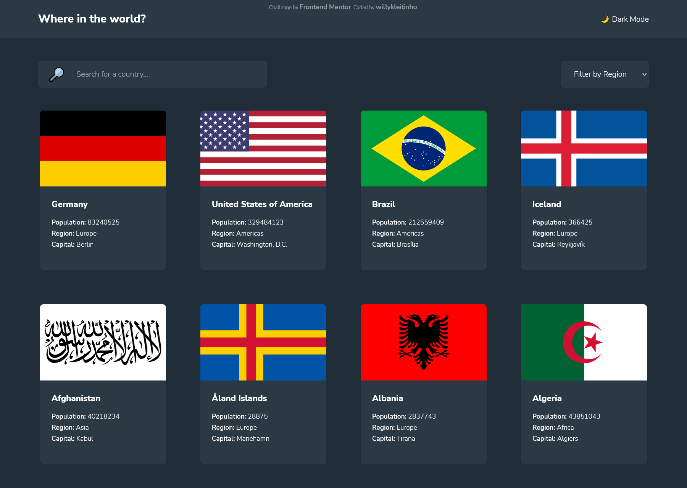

# Frontend Mentor - REST Countries API with color theme switcher solution

This is a solution to the [REST Countries API with color theme switcher challenge on Frontend Mentor](https://www.frontendmentor.io/challenges/rest-countries-api-with-color-theme-switcher-5cacc469fec04111f7b848ca). Frontend Mentor challenges help you improve your coding skills by building realistic projects. 

## Table of contents

- [Overview](#overview)
  - [The challenge](#the-challenge)
  - [Screenshot](#screenshot)
  - [Links](#links)
- [My process](#my-process)
  - [Built with](#built-with)
  - [What I learned](#what-i-learned)
  - [Continued development](#continued-development)
- [Author](#author)

## Overview

### The challenge

Users should be able to:

- See all countries from the API on the homepage
- Search for a country using an `input` field
- Filter countries by region
- Click on a country to see more detailed information on a separate page
- Click through to the border countries on the detail page
- Toggle the color scheme between light and dark mode *(optional)*

### Screenshot

### Links

- Solution URL: [on Frontend Mentor](https://your-solution-url.com)
- Live Site URL: [on Netlify](https://sharp-nightingale-e918a0.netlify.app)

## My process

### Built with

- Semantic HTML5 markup
- CSS custom properties
- Flexbox
- CSS Grid
- Mobile-first workflow
- [React](https://reactjs.org/) - JS library
- [Styled Components](https://styled-components.com/) - For styles

### What I learned

In this project, I used Styled Components for the first time. I think it's good for large projects, but not so good for small ones. I'll come up with a bigger on to fully test it.
I also practiced error handling while fetching something.

### Continued development

I'll learn about the other CSS-in-JS libraries and the React best practices.

## Author

- Github - [@willykleitinho](https://github.com/willykleitinho)
- Frontend Mentor - [@willykleitinho](https://www.frontendmentor.io/profile/willykleitinho)
